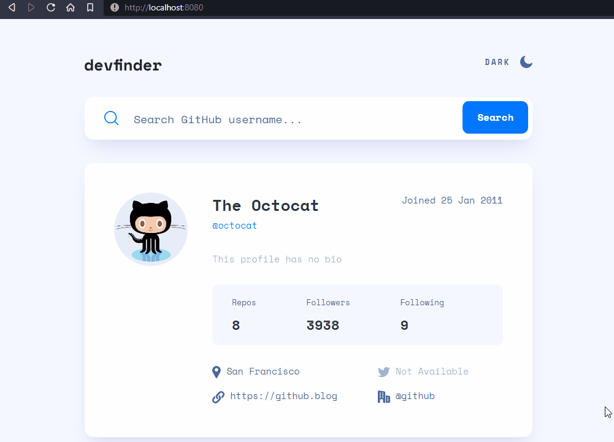
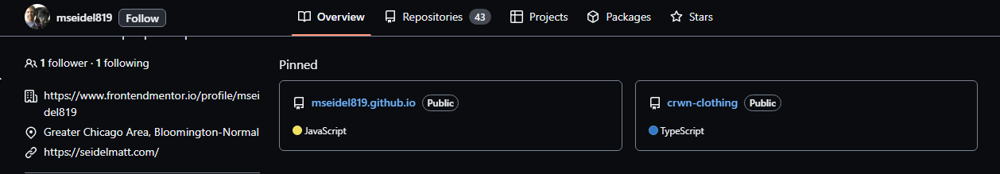
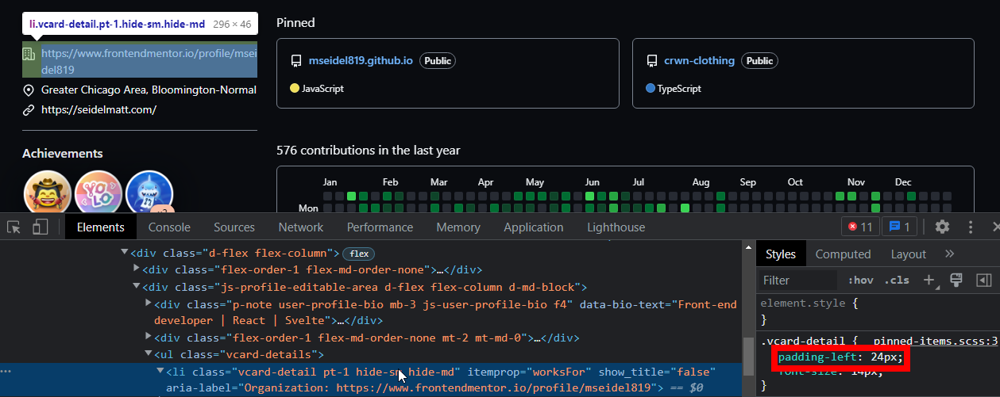
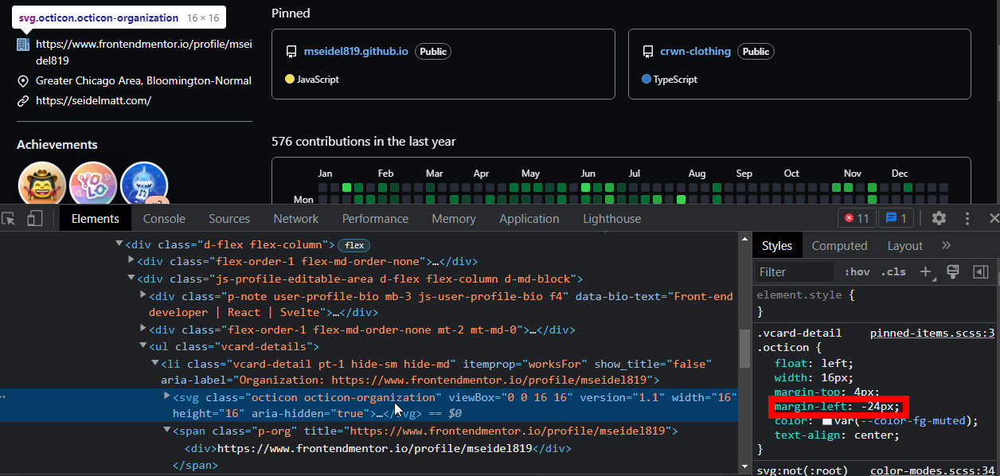
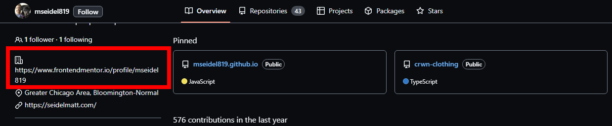
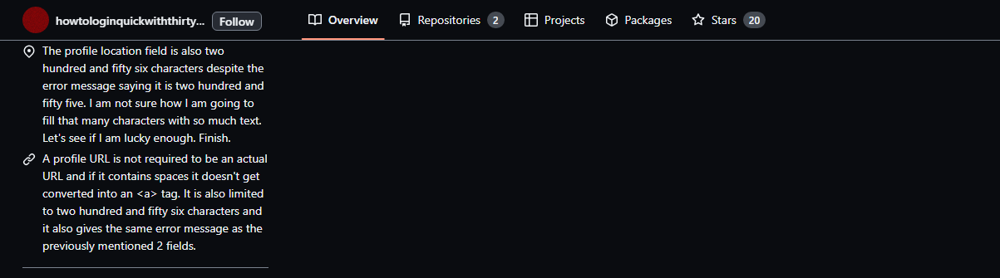
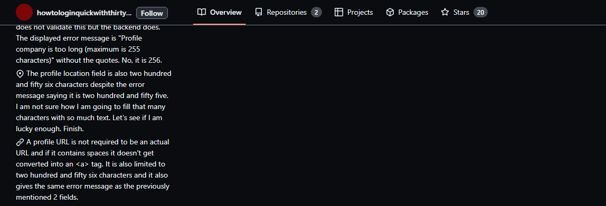
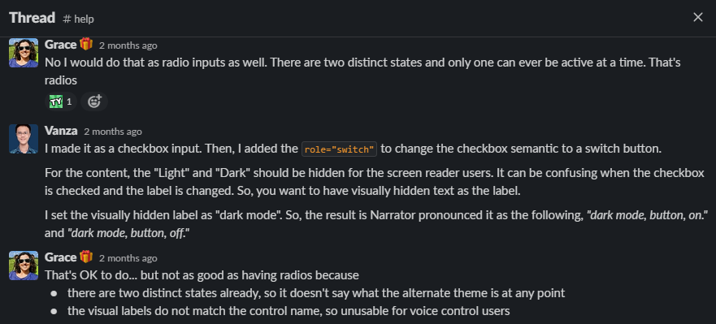
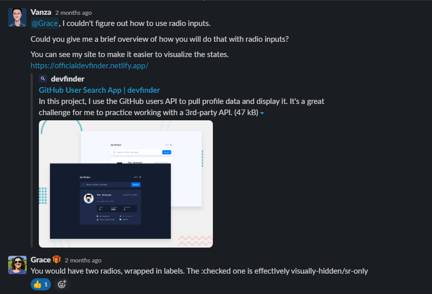

# GitHub User Search App

This is my first API challenge from Frontend Mentor. In this project, I learned about asynchronous programming and worked with a 3rd-party API.

## Disclaimer

This project is solely for learning purposes. I take no any responsibility or liability for the accuracy, completeness, or usefulness of any information provided in this project. You should not use it as a reference for creating your project.

I am currently no longer working on this project.

## The challenge

My challenge is to build out this GitHub user search app using the GitHub users API and get it looking as close to the design as possible.

My users should be able to:

- View the optimal layout for the app depending on their device's screen size
- See hover states for all interactive elements on the page
- See visible focus states for interactive elements when navigating by keyboard
- Search for GitHub users by their username
- See relevant user information based on their search
- Switch between light and dark themes
- Understand and be able to navigate page content while using assistive technology
- Have the correct color scheme chosen for them based on their browser preferences

## Links

- [Live Review](https://officialdevfinder.netlify.app/)
- [Frontend Mentor Solution Page](https://www.frontendmentor.io/solutions/github-user-search-app-html-css-sass-javascript-async-await-nBt6_lQS5M)

## Screenshots


## Built with

- HTML Semantic Tags
- [BEM (Block, Element, Modifier)](https://sparkbox.com/foundry/bem_by_example)
- [Sass](https://sass-lang.com/)
- JavaScript Async Await and Fetch API
- CSS flexbox and grid
- [GitHub user API](https://docs.github.com/en/rest/users/users#get-a-user)
- [ipify - A Simple Public IP Address API](https://www.ipify.org/)
- Mobile-first workflow

## What I learned

I learned a lot of things while building this project and I wrote everything that I learned.

### GitHub user API

Here is the URL.

```txt
https://api.github.com/users/{username}
```

The documentation shows that I can get:

- User's data in JSON format
- `200` or `404` HTTP response status code

See the documentation — [Users - GitHub Docs #get-a-user](https://docs.github.com/en/rest/users/users#get-a-user)

For the status code, there is a chance that I can get `403`. This happened after I did so many requests.


### Asynchronous programming

Asynchronous programming is a program that doesn't block the main process of executing JavaScript.

The example of asynchronous programming that I can think of is the `setTimeout()` function.

```javascript
setTimeout(() => {
  console.log("What did I miss?");
}, 3000)
console.log("I don't get blocked by the setTimeout() function");
console.log("Me too!");

// Output:
// > I don't get blocked by the setTimeout() function
// > Me too!
// > What did I miss?
```

### Two ways to make a request to the API

Two ways to get the user data from the GitHub API.

- First, an old-school way is by using `XMLHttpRequest()`.
- Second, the modern way is by using Fetch API.

This is the code snippet to get the user's data using `XMLHttpRequest()`.

```javascript
const fetchUserData = (username) => {
  const xhr = new XMLHttpRequest();

  xhr.open("GET", `https://api.github.com/users/${username}`);

  xhr.responseType = "json";

  xhr.onreadystatechange = () => {
    const DONE = 4;
    const OK = 200;

    if (xhr.readyState === DONE) {
      if (xhr.status === OK) {
        const json = xhr.response;
        showUserData(json);
      }
    }
  };
};
```

In comparison with Fetch API, it is much shorter than using the old-school way.

```javascript
fetch(`https://api.github.com/users/${username}`)
  .then((response) => response.json())
  .then((json) => /* do something */)
```

Resources:

- [XMLHttpRequest - Web APIs | MDN](https://developer.mozilla.org/en-US/docs/Web/API/XMLHttpRequest)
- [Fetch API - Web APIs | MDN](https://developer.mozilla.org/en-US/docs/Web/API/Fetch_API)

### Elegant way to work with promises

Instead of using `.then()`, a better way to deal with `Promise` which is by using `async` and `await` keywords.

```javascript
const fetchUserData = async (username) => {
  try {
    const response = await fetch(`https://api.github.com/users/${username}`);
    const json = await response.json();
    /* do something */
  } catch (error) {
    /* handle error */
  }
}
```

### Color flashing

Color flashing happens when the saved color scheme is the opposite color scheme of the browser's preference.

For example, the browser's color scheme is light and the saved color scheme is dark. When the user refreshes the page, the app's color scheme is white and will be dark after several milliseconds.

I created a GIF that demonstrates the color flashing.

<details>
<summary>Color flashing demo</summary>



</details>

Color flashing happens because the script only runs after the HTML has been fully parsed. That's why the app will be using the default color scheme at first. Once the script is executed, only then the app will use the saved color scheme (by checking the `localStorage`).

For your information: I hide the GIF because not all people can deal with animation. So, it is best to hide it by default. Learn more — [Your Interactive Is Making Me Sick](https://source.opennews.org/articles/motion-sick/) and [Accessibility For Vestibular Disorders](https://alistapart.com/article/accessibility-for-vestibular/).

### How to switch the color scheme correctly?

Three things that I need to make the app switch color scheme correctly.

- First, the app follows the user's color scheme preference.
- Second, the app should be able to remember the user's latest selected color scheme.
- Third, no color flashing.

To achieve the first goal, I needed to use `prefers-color-scheme` media query. I used CSS custom properties to control all the colors for all elements.

For example:

```css
:root {
  /* color variables */
  --very-light-blue: hsl(227, 100%, 98%);
  --dark-blue-100: hsl(217, 35%, 45%);
  --very-dark-blue-300: hsl(220, 40%, 13%);
  --white: hsl(0, 0%, 100%);

  /* variables that handle the color for each element */
  --body-background-color: var(--very-light-blue);
  --body-font-color: var(--dark-blue-100);
}

@media screen and (prefers-color-scheme: dark) {
  :root {
    --body-background-color: var(--very-dark-blue-300);
    --body-font-color: var(--white);
  }
}

body {
  background-color: var(--body-background-color);
  color: var(--body-font-color);
}
```

As a result, the `<body>`'s background color and text color are adapting to the user's color scheme preference.

Next, I needed to understand different ways the user to change the color scheme of the website. This way, I would know what I should do to make the app remembers the latest selected color scheme.

The user can change the color scheme of the website by:

- Clicking the theme switcher
- Changing the color scheme preference from the browser's setting

After knowing that, I should make sure that the app's color scheme should be able to adapt. Whether the users change the color scheme with the theme switcher or switch the browser's color scheme, the app's color scheme should change.

To make the app remembers the latest selected color scheme, I used `localStorage` to store the user's latest choice if the user uses the theme switcher. When the user changes the browser's color scheme, I clear the `localStorage` and make the app follows that.

This way, the latest user's setting will always get applied, regardless of the way the user changes the color scheme.

After that, I needed to prevent the app from having color flashing.

I created a new JavaScript file that set the app's color scheme. I made the script load synchronously. This way, the app's color scheme has been set up when the page is fully loaded. Also, the app does not have color flashing.

The script works by checking the `localStorage` if there is a saved color scheme. If there is, then apply the value as the class of the `<html>` element. Otherwise, the script will not do anything.

With all of those, the app's color scheme is adapting to different situations and has no color flashing. That is how to switch the app's color scheme correctly.

Resources:

- [prefers-color-scheme - CSS: Cascading Style Sheets | MDN](https://developer.mozilla.org/en-US/docs/Web/CSS/@media/prefers-color-scheme)
- [Window.localStorage - Web APIs | MDN](https://developer.mozilla.org/en-US/docs/Web/API/Window/localStorage)

### Regular Expressions

GitHub allows the user to input any data. For example, the user is allowed to input "hello world" for the website's URL. So, I had to use regular expressions to check the user's data and render the content with appropriate HTML markup.

#### Date

The first regular expression is used to get the date format for the date the user's account was created.

```js
const dateRegEx = /\d{2} [A-Z][a-z]{2} \d{4}/;
```

Here is an example of the user's data:

```json
{
  "created_at": "2021-02-13T23:22:17Z"
}
```

Then, I did the following to get the date format.

```js
const formattedDate = new Date("2021-02-13T23:22:17Z").toUTCString().match(dateRegEx)[0];
// Output
// 13 Feb 2021
```

#### Whitespace

The second regular expression is used to check whitespace in a URL.

```js
const whitespaceRegEx = /\s/;
```

Here is the an example of the user's data:

```json
{
  "blog": "https://www.linkedin.com/in/vanzasetia/"
}
```

If there is no whitespace, then it is a URL, and it will be rendered as a link. Otherwise, it will be rendered as normal text.

Here is an example of an invalid URL:

```json
{
  "blog": "hello world"
}
```

#### HTTP

The third regular expression is used to check `http` or `https` within the URL.

```js
const HTTPRegEx = /^https?:\/\//;
```

This is another regular expression to check the value of the `blog` data. If the string does not contain whitespace and `http`, then add `http` to it.

For example, if the string is `github.com`, the end result will be `http://github.com`.

If the string contains `http` or `https` then it will pass the test and wrap the URL with `<a>` element.

#### At sign

The fourth regular expression is used to check if the value of the `company` data has `@` symbol or not.

```js
const companyRegEx = /@/;
```

Here is an example of the data:

```json
{
  "company": "@frontendmentorio"
}
```

If the value of the `company` data has `@` symbol, I assume that the company has a GitHub account. So, it will be rendered as a link.

Here is an example of the HTML markup:

```html
<a href="https://github.com/frontendmentorio" rel="nofollow me">
  @frontendmentorio
</a>
```

If there is not `@` symbol, then it will be rendered as normal text.

#### GitHub username

The fifth regular expression is used to check the user's input on the search text field.

```js
const githubUserNameRegEx = /^[a-z\d](?:[a-z\d]|-(?=[a-z\d])){0,38}$/i;
```

The regular expression follows the real criteria.


A valid username is a username that:

- Has less than or exactly 39 characters
- Do not start and end with a hyphen
- Contain alphanumeric characters or single hyphens

With that regular expression, if the user tries to search for an invalid username, then it won't search and throw an error message "Invalid username" on the UI.

For your information, I did not create this regular expression. I got it from the following repository.

[shinnn/github-username-regex: A regular expression that only matches a currently valid Github username](https://github.com/shinnn/github-username-regex)

### Overflowing text

Yazdun noticed that there is an overflowing issue when tries to view mseidel819's profile with my app.


Here is the issue:


I did some research on the internet to find an answer to the issue. I found the MDN documentation page that explains how to manage overflowing text with CSS.

[Wrapping and breaking text - CSS: Cascading Style Sheets | MDN](https://developer.mozilla.org/en-US/docs/Web/CSS/CSS_Text/Wrapping_Text)

I didn't manage to find the answer on the website. But, I got some information about some CSS properties that deal with text wrappings, such as `word-break` and `overflow` properties.

Then, I was thinking about the way GitHub handle overflowing text. Then, I took a look at the mseidel819 profile on GitHub. After that, I inspected the styling of the element that has overflowing text.


GitHub used the following CSS to handle overflowing text:

```css
.css-truncate.css-truncate-target {
  overflow: hidden;
  text-overflow: ellipsis;
  white-space: nowrap;
}
```

I copied that code snippet and applied it to my own stylesheet. And here is the result:


You might be wondering that if the text content is not visible, then how the users would access the content? It can't be visually accessible. But, the text content is still 100% available. I tried to copy-paste the text and got the full value. Also, I tested the site with Narrator and it could read the whole text.

The better solution is to make the two-column layout a one-column layout instead.


I think that is a good solution because not only it fixes the overflowing issue, but also there's no visually hidden text. Everything can be seen clearly and nicely.

But, I still follow GitHub's approach to solve the issue. The reason is that the challenge is trying to create the app to look as close to the design as possible. So, I still follow the design from the original design.

### Better solution to overflowing text issue

While refactoring this project on 4th January 2023, I notice that GitHub is using different approach.

Now, GitHub does not truncate the text. Instead it shows everything.



The only styling that it has is to set `word-wrap: break-word;` to the text element that is wrapped with a `<div>`.

Also, GitHub does a "smart trick" to ensure that the text content aligns vertically.

First, GitHub sets some `padding-left` to the `<li>`.



Second, GitHub sets some negative `margin-left` and `float: left` to the `<svg>`.



Without those styling, the icon will be included in the normal flow and makes the layout not align properly.



To make it even clearer, I recommend taking a look at the following screenshots.

With the "smart trick", the icon is not joined with the text.



Without the trick, the icon is in line with the text.



### Placeholder and label

Here is the HTML markup.

```html
<input
  type="text"
  id="username-input"
  placeholder=" "
  required
/>
<label for="username-input">
  Search GitHub username...
</label>
```

The idea is to put the `<label>` inside the `<input>`. It means that the `<label>` will be acting as a placeholder.


Then, once the user inputs a character, the `<label>` becomes an actual label.


This pattern is known as the "float label pattern".

The reason for doing this is that there is no visible label on the design. As a user, sometimes I forget about the input. So, by making sure the label is visible when I input a character, I know what the input is about.

As a side note, It is important to know that a placeholder is not a replacement for a label.

Now, the floating label is not the best solution. The best solution is to provide a visible label all the time. In other words, the `<label>` is always acting like a label.

Example of visible label pattern — [accessible-form | CodePen](https://codepen.io/vanzasetia/pen/yLjQbYZ)

Another reason is when the `<label>` becomes a label, the logo and the `<label>` are not having enough whitespace between them. They are too close together.


In summary, a floating label is a possible solution for this situation. I need to make sure that the app looks as close as possible to the design. But, a visible label is still the best solution because `<label>` only needs to be a label.

I recommend watching the following video made by Heydon Pickering. In that video, Heydon is talking about different designs of input and label.

[What Happened To Text Inputs? - YouTube](https://www.youtube.com/watch?v=he8wuV880Fc)

Resources:

- [HTML Standard #the-placeholder-attribute](https://html.spec.whatwg.org/multipage/input.html#the-placeholder-attribute)
- [Float label pattern in UX form design](https://scribe.rip/float-label-pattern-in-ux-form-design-7ab5e33010ab)
- [Floating labels are problematic](https://scribe.rip/simple-human/floating-labels-are-a-bad-idea-82edb64220f6)
- [Float Label Pattern | Brad Frost](https://bradfrost.com/blog/post/float-label-pattern/)

## Useful resources

- [A Theme Switcher | Inclusive Components](https://inclusive-components.design/a-theme-switcher/) and [Toggle Buttons | Inclusive Components](https://inclusive-components.design/toggle-button/) articles are helping me to create an accessible theme switcher. I recommend everyone that doing this challenge read both articles.
- [ryanmcdermott/clean-code-javascript: Clean Code concepts adapted for JavaScript](https://github.com/ryanmcdermott/clean-code-javascript) - I wish that I know this repository when I was writing the JavaScript. This repository contains a lot of best practices on how to write clean JavaScript code. I highly recommend taking some time to read it.
- [RegExr](https://regexr.com/) - This is the tool that I used when I was crafting or testing a regular expression that I wanted to use. It has a handy cheat sheet and is easy to use. I recommend using it for anyone that wants to create or test some regular expressions.

## Acknowledgements

Thanks to [@shinnn](https://officialdevfinder.netlify.app/?user=shinnn) for the regular expression!

See the regular expression for GitHub username — [shinnn/github-username-regex: A regular expression that only matches a currently valid GitHub username](https://github.com/shinnn/github-username-regex)

Thanks to Grace for helping me improve the accessibility of the site!

She helped me by:

- Answering all my questions on the solution page
- Telling me to add a live region to announce the result to the screen reader users
- Giving me information that radio inputs are better than a checkbox input for the theme switcher
- Telling me to simplify things or, in other words, not to overcomplicate accessibility

[Frontend Mentor | Grace's profile](https://www.frontendmentor.io/profile/grace-snow)

Here are screenshots of our Slack conversation.





## License

[The Unlicense](./UNLICENSE)

## References

See the [documentation](./docs/README.md).
