<p align="left">
  <a href="https://www.frontendmentor.io/challenges?difficulties=2"></a>
  
  <a href="https://twitter.com/vanzasetia"></a>
  
  
  
</p>

<p>
  <a href="https://jigsaw.w3.org/css-validator/validator?uri=https%3A%2F%2Fofficialdevfinder.netlify.app&profile=css3svg&usermedium=all&warning=1&vextwarning=&lang=en">
    
    </a>
    <a href="https://github.com/standard/semistandard">
      
    </a>
</p>

# GitHub User Search App

## Table of contents
- [Overview](#overview)
  - [Introduction](#introduction)
  - [The challenge](#the-challenge)
  - [Links](#links)
  - [Screenshots](#screenshots)
- [My process](#my-process)
  - [Built with](#built-with)
  - [What I learned](#what-i-learned)
  - [Useful resources](#useful-resources)
- [Author](#author)
- [Acknowledgements](#acknowledgements)
- [License](#license)
- [References](#references)

## Overview
[(Back to top)](#table-of-contents)

### Introduction
Welcome to the `README.md` of this repo! The purpose of creating this project is to sharpen my coding skill.

In this file I'm going to tell you everything, starting from the tools that I used, and much more.

That's it for the introduction and **happy reading!**
### The Challenge

My challenge is to build out this GitHub user search app using the [GitHub users API](https://docs.github.com/en/rest/users/users#get-a-user) and get it looking as close to the design as possible.

My users should be able to:

- View the optimal layout for the app depending on their device's screen size
- See hover states for all interactive elements on the page
- See visible focus states for interactive elements when navigating by keyboard
- Search for GitHub users by their username
- See relevant user information based on their search
- Switch between light and dark themes
- Understand and be able to navigate page content while using assistive technology
- Have the correct color scheme chosen for them based on their computer preferences.

### Links
- [Live Review](https://officialdevfinder.netlify.app/)
- [Frontend Mentor Solution Page](https://www.frontendmentor.io/solutions/github-user-search-app-html-css-sass-javascript-async-await-nBt6_lQS5M)

### Screenshots

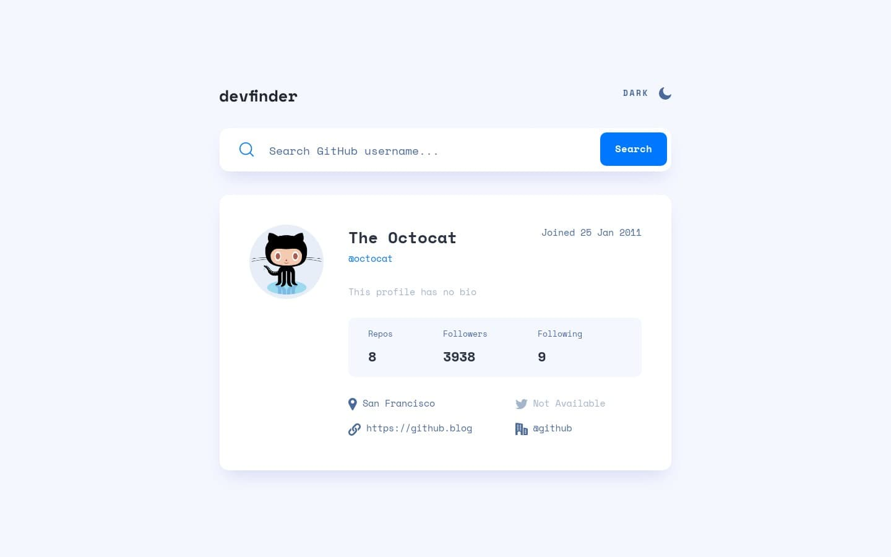

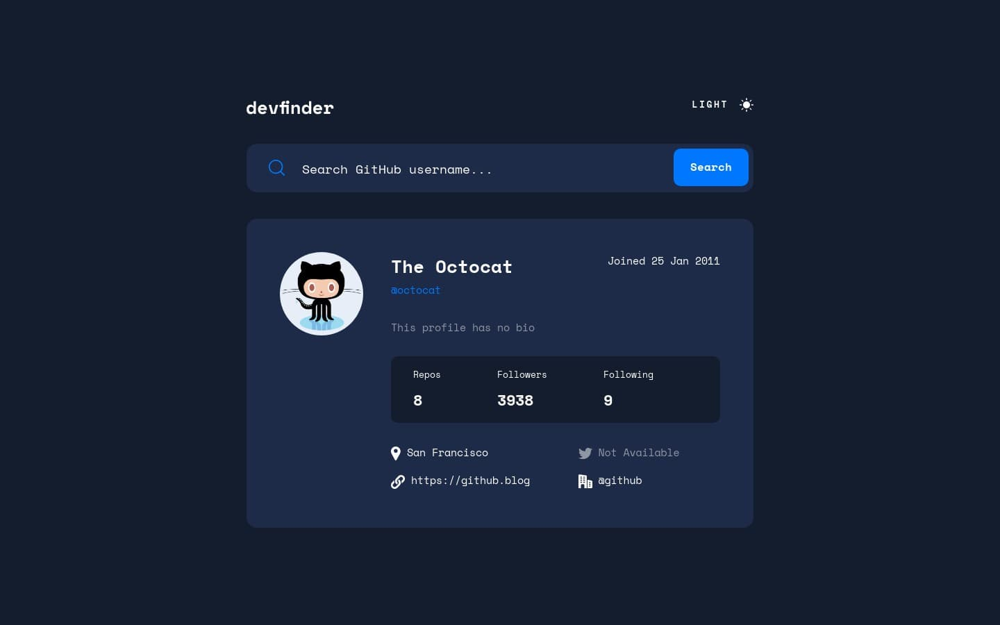

## My Process
[(Back to top)](#table-of-contents)

### Built With
- **Following best practices**\* 
- HTML Semantic Tags
- [BEM (Block, Element, Modifier)](https://sparkbox.com/foundry/bem_by_example) Class *Naming Convention*
- [Sass](https://sass-lang.com/)
- JavaScript Async Await
- JavaScript Fetch API
- CSS Flexbox
- CSS Grid
- [GitHub user API](https://docs.github.com/en/rest/users/users#get-a-user)
- [ipify - A Simple Public IP Address API](https://www.ipify.org/)
- Mobile-first workflow

> \* I follow guidelines. [See what guidelines that I follow.](./docs/README.md#guidelines)

### What I Learned

#### GitHub User API
[(Back to top)](#table-of-contents)

Here is the URL.

```
https://api.github.com/users/{username}
```

The [documentation](https://docs.github.com/en/rest/users/users#get-a-user) shows it clearly that we will get:
- User's data in JSON format
- For the HTTP response status code, we can get either `200` or `404`

Now, for the status code, there is a chance that we can get `403`. This will happen if you do a lot of requests. As a result, you will not allow to do any request with that IP address.

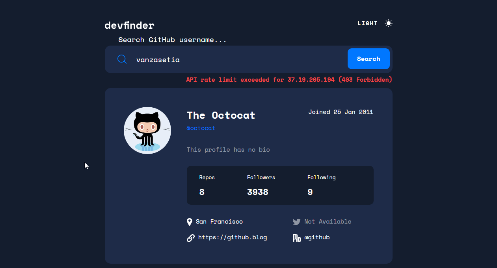

Now, we have a good understanding of what can we possibly get when making a request to the API. It's time to talk about asynchronous programming!

#### Asynchronous Programming
[(Back to top)](#table-of-contents)

Based on my understanding, asynchronous programming is a program that doesn't block the main process of executing JavaScript. Simple, right? Well, try to take a look yourself at the [Wikipedia definition for asynchronous programming](https://en.wikipedia.org/wiki/Asynchrony_(computer_programming)) for the complete definition. (It's confusing for me. 😅)

The easiest example of asynchronous programming that I could think of is the `setTimeout()` function.

```javascript
setTimeout(() => {
  console.log("What did I miss?");
}, 3000)
console.log("I don't get blocked by the setTimeout() function");
console.log("Me too!");

// Expected output:
// > I don't get blocked by the setTimeout() function
// > Me too!
// > What did I miss?
```

The example above reminds me of the Internet Explorer meme.

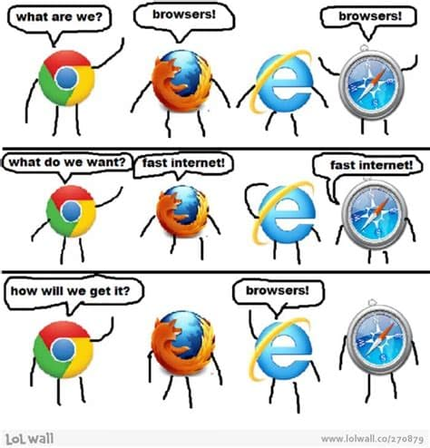

#### Multiple Ways to Make a Request to the Server
[(Back to top)](#table-of-contents)

There are two ways that I learned.
- First, an old-school way of doing it is by using [`XMLHttpRequest()`](https://developer.mozilla.org/en-US/docs/Web/API/XMLHttpRequest).
- Second, the new way of doing it is by using [Fetch API](https://developer.mozilla.org/en-US/docs/Web/API/Fetch_API).

I was using both of them. I found that both of them were confusing to me (bad first impression). 😆

When using `XMLHttpRequest`, there are things that I love and I hate. 

I love it because it has everything. For example, if you want to specify the data type that you will get then you can do, [`XMLHttpRequest.type`](https://developer.mozilla.org/en-US/docs/Web/API/XMLHttpRequest/responseType). 

I hate it because it can't return the data. So, if you want to access the data then you have to use it inside the `function`. The reason is simply that it is an asynchronous process. Also, I have to keep creating a new `XMLHttpRequest` object. Otherwise, it will be impossible to use it.

By the way, this is the way I used it. (it's not a complete code if you want to see the full code, [view xmlhttprequest.js file](./js/xmlhttprequest.js))

```javascript
const fetchUserData = (username) => {
  const xhr = new XMLHttpRequest();

  xhr.open("GET", `https://api.github.com/users/${username}`);

  xhr.responseType = "json";

  xhr.onreadystatechange = () => {
    const DONE = 4;
    const OK = 200;

    if (xhr.readyState === DONE) {
      if (xhr.status === OK) {
        const json = xhr.response;
        showUserData(json);
      }
    }
  };
};
```

Maybe, I should use the callback approach (?).

```javascript
// set a second parameter called "callback" 
// which will be a function (or callback function).
const fetchUserData = (username, callback) => {
  const xhr = new XMLHttpRequest();

  xhr.open("GET", `https://api.github.com/users/${username}`);

  xhr.responseType = "json";

  xhr.onreadystatechange = () => {
    const DONE = 4;
    const OK = 200;

    if (xhr.readyState === DONE) {
      if (xhr.status === OK) {
        const json = xhr.response;
        // call the callback to access the data
        callback(json);
      }
    }
  };
};
```

**Next!** It is the Fetch API!

It is much simpler though and also it can return data (unlike `XMLHttpRequest`). It is also globally available (or available in global scope). It means that I don't have to keep creating a new fetch object.

So, it is very simple!

If I want to simply fetch user data then this code will work.

```javascript
fetch(`https://api.github.com/users/${username}`)
  .then((response) => response.json())
  .then((json) => /* do whatever I like */)
```

To handle error, I used the `.catch()`.

```javascript
fetch(`https://api.github.com/users/${username}`)
  .then((response) => response.json())
  .then((json) => /* do whatever I like */)
  .catch((error) => /* handle error */)
```

#### Elegant Way to Work with Promises
[(Back to top)](#table-of-contents)

In real life, sometimes it is really hard to keep our promises. Sometimes, I need to break another promise to keep another promise. It can be complicated! But, how about in the JavaScript world?

In JavaScript, there is a better way to deal with `Promise` which is by using `async` and `await` keywords. So, instead of keeping doing `.then()` or even worse a lot of `callback` functions we can deal with it more elegantly.

So, in async/await the code will be something like this.

```javascript
const fetchUserData = (username) => {
  try {
    const response = await fetch(`https://api.github.com/users/${username}`);
    const json = await response.json();
    /* do something with the json */
  } catch (error) {
    /* handle error */
  }
}
```

#### Dark Mode in Hard Mode
[(Back to top)](#table-of-contents)

Enough with API! Now, let's talk about another important feature of the application which is switching between light mode and dark mode.

I love dark mode. So, this is something that I have to be able to do. But, it is not as simple as toggling a CSS class because there are things that I need to keep in mind.

- First, I need to make sure that the app follows the user's color scheme preference.
- Second, the app should be able to remember the user's latest selected color scheme.
- Third, there should not be [*flashing*](#flashing).

Now, let me explain how I managed to keep these three things working together.

The first one is pretty straightforward. All I need to do was to use the `prefers-color-scheme` media query. But, it was not just like that. I used CSS custom properties to control all the colors for the element.

For example for the `body` background color and text color:

```css
:root {
  /* color variables */
  --very-light-blue: hsl(227, 100%, 98%);
  --dark-blue-100: hsl(217, 35%, 45%);
  --very-dark-blue-300: hsl(220, 40%, 13%);
  --white: hsl(0, 0%, 100%);

  /* variables that handle the color for each element */
  --body-background-color: var(--very-light-blue);
  --body-font-color: var(--dark-blue-100);
}

@media screen and (prefers-color-scheme: dark) {
  :root {
    --body-background-color: var(--very-dark-blue-300);
    --body-font-color: var(--white);
  }
}
```

For the rest of the other elements, I did the same thing.

Next, to make the app remembers the latest user's color scheme preference, I used `localStorage`. But, the way I did it might be interesting for you.

There are two possible ways for the user to change the color scheme of the website.

- First, the user can click the theme switcher.
- Second, the user can change the color scheme preference from the user's system setting.

Here is what I was doing.

So, when the user changes the color scheme through the user's system setting then, the website would follow it and also removes the latest user's color scheme. By doing this, the app can adapt to different situations.

(Make sure you drink enough water before reading the next section. I am telling you this because it can be confusing.)

There are two scenarios:
- First scenario, the user visits the site with light mode because the user's color scheme preference is light. Then, the user decides to switch to dark mode by clicking the theme switcher. After that, the user clicks the theme switcher again, so the color scheme of the website would be light. Then, the user changes the color scheme preference to dark. Then, the app will change to dark mode as well.
- Second scenario, the user visits the site with light mode because the user's color scheme preference is light. Then, the user decides to switch to dark mode by clicking the theme switcher. After that, the user changes the user's color scheme preference to dark. The website is still in dark mode. But, what happens in the background, the app will remove the user's latest selected color scheme. Then, the user switches the color scheme to dark by clicking the theme switcher. After that, if the user closes the browser and then opens the website again, the website will be still in dark mode.

So, the conclusion is that the app can adapt. As simple as that.

> You might be wondering. Who is the one who will be doing this? And the answer is **me**. I don't how other users would use the website. But, since it is a possible thing to happen so I think it's best to be prepared. 😅

Next! How did I prevent the app from *flashing*?

I had this JavaScript code to check the user's latest selected color scheme.

```javascript
const rootClassTheme = localStorage.getItem("root-class");
if (rootClassTheme) {
  const root = document.querySelector("html");
  root.classList.add(rootClassTheme);
}
```

So, what the code does is check if the `localStorage` saved the latest user's selected color scheme. If it has, then apply the color scheme by adding the class to the `html` element.

#### Flashing
[(Back to top)](#table-of-contents)

Flashing or *color flashing* can be happening when the user's latest selected color scheme is the opposite color scheme of the system's preference.

For example, the user's system's color scheme preference is light. Then, the user changes the color scheme to dark by clicking the theme switcher. After that, the user closes the browser's window to eat breakfast. After the user finishes breakfast, the user comes back to the site. The user will notice that the first time the user visits the page, the user can see light mode for a short amount of time. Lastly, the page changes back to dark mode.

I have created a GIF that demonstrates the flashing.

<details>
<summary>Expand to see the GIF</summary>


</details>

It is happening because the JavaScript will only be downloaded after the document (HTML) has been fully parsed (`defer` attribute). That's why there are some milliseconds (in my case) where the page will be using the default color scheme and then applying the user's latest selected color scheme.

> For your information: I hide the GIF by default. But, you can still see it if you want. It is useful because not all people can deal with animation. For more information, I recommend reading these articles [*"Your Interactive Is Making Me Sick"*](https://source.opennews.org/articles/motion-sick/) and [*"Accessibility For Vestibular Disorders"*](https://alistapart.com/article/accessibility-for-vestibular/).

#### Regular Expressions
[(Back to top)](#table-of-contents)

I used some regular expressions to validate the user's data. So, here are all the regular expressions with some explanations.

The first RegEx is the date RegEx. It is used to get the value from the `new Date(date).toUTCString()`. The return value of the `toUTCString()` is the same format that I need to render the joined date.

```javascript
/**
 * 
 * Date
 * - Must have two digits for the day of the month
 * - For the Month:
 *   - Must be three letters
 *   - The first letter must be capitalized
 * - Must have four digits for the year
 * 
 * @author Vanza Setia <https://github.com/vanzasetia>
 */

const dateRegEx = /\d{2} [A-Z][a-z]{2} \d{4}/;
```

The second RegEx is the whitespace RegEx. I used this RegEx to check if the value of the `website_url` contains whitespace. If it does contain whitespace then I will just render it as a plain text.

```javascript
const whitespaceRegEx = /\s/;
```

The third RegEx is the HTTP RegEx. It is used to check whether the link contains `http` or `https`. The reason for doing this is because if the `website_url` doesn't contain the `http` or `https` then the script has to add it.

If I don't add it, for example, the value that I get for the website URL is [example.com](example.com) then it will navigate to [https://officialdevfinder.netlify.app/example.com](https://officialdevfinder.netlify.app/example.com).

```javascript
/**
 * 
 * HTTP
 * - Must be started with "http"
 * - Optionally to be "https"
 * - Must be followed by "://"
 * 
 * @example
 * // return false
 * const HTTPRegEx = /^https?:\/\//;
 * HTTPRegEx.test("example.com")
 * 
 */
const HTTPRegEx = /^https?:\/\//;
```

The fourth RegEx is the company RegEx. It is used to check for the `company` value. So, if the `company` value has `@` character then I want to make it a link. Otherwise, I would just show it as it is (as normal text). For example, if the value of the `company` is `@github` then the script will make wrap it with an anchor tag and also provide the link to the company profile, [@github](https://github.com/github). But, if the value of the `company` is `Example Company` then it will be rendered as plain text.

```javascript
const companyRegEx = /@/;
```

But, there is an issue that I don't know how to solve. If the user puts a fake company with `@` character then it will get converted to a link even though the company has no GitHub account. For example, if the value of the `company` is `@randomcompany` then the script will make wrap it with an anchor tag and also provide the link to the company profile, [@randomcompanywhichdoesntexist](https://github.com/randomcompanywhichdoesntexist).

I actually have an idea. The idea is to check whether the link exists or not. But, it is not possible to check it with `fetch()`. I did some research and it looks like I have to use PHP. (I don't understand PHP)

Last but an important one is a RegEx that is used to check the user's input. So, if the user's input is valid then start searching for the user. If it is not valid then, the app will just give an alert.

```javascript
/**
 * source: https://github.com/shinnn/github-username-regex
 */
const githubUserNameRegEx = /^[a-z\d](?:[a-z\d]|-(?=[a-z\d])){0,38}$/i;
```

It is not created by me. It is created by a GitHub user called [shinnn](https://github.com/shinnn). This person is creating the RegEx based on the official GitHub valid username.


#### Overflowing Text
[(Back to top)](#table-of-contents)

At this moment, I thought that I had done with the challenge. Then, [Yazdun](https://www.frontendmentor.io/profile/Yazdun) came in and said that there is an overflowing issue when he searched **mseidel819**.


Then, my brain said to me, *"let's fix the bug!"*

So, now let's take a look at the overflowing issue!

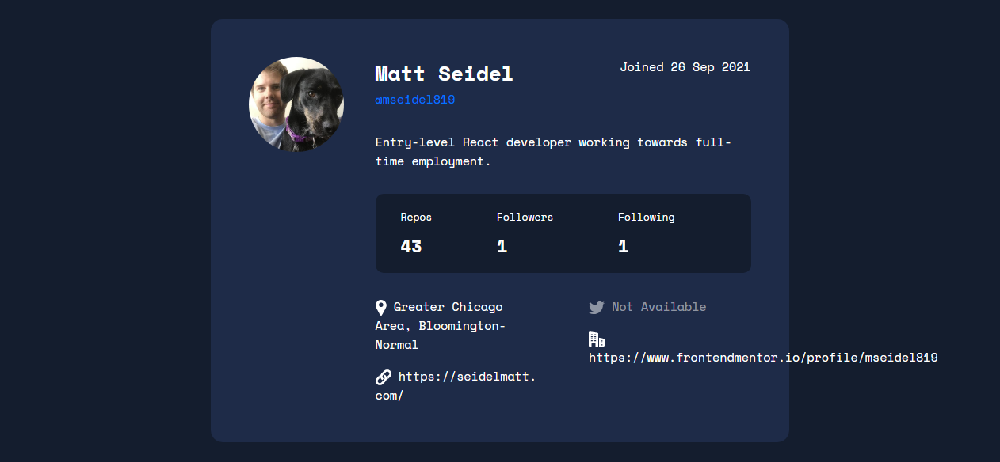

Okay, it's not looking good. So, I have to do something.

As a developer, the first thing I did was do some research on the internet. I found the [MDN documentation page that explains how to deal with the overflowing text](https://developer.mozilla.org/en-US/docs/Web/CSS/CSS_Text/Wrapping_Text).

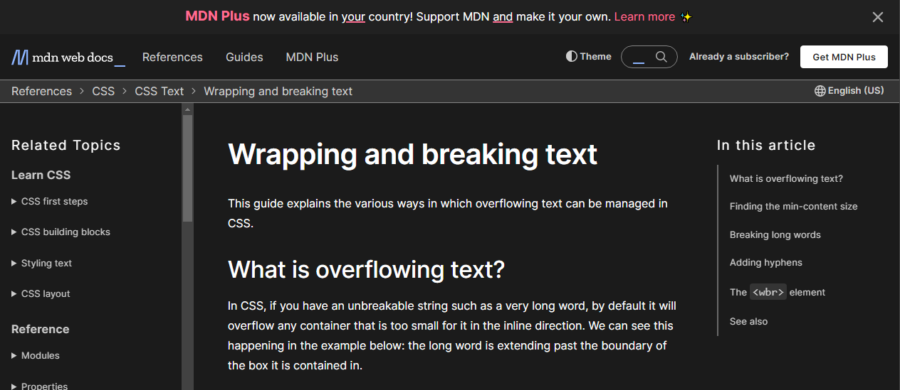

I didn't manage to find the answer on the website. But, I got some information about some CSS properties that deal with text wrappings such as `word-break` and `overflow` properties. 

I had used `word-break` earlier to fix the long URL issue.

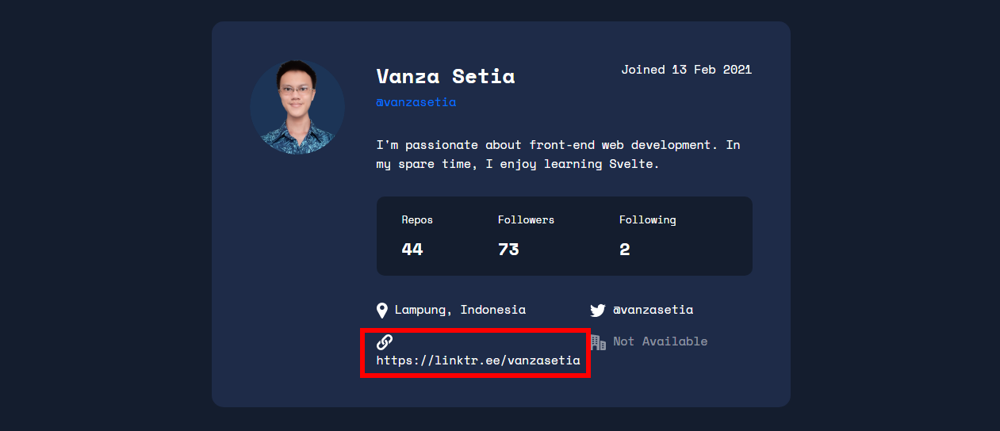

After applying `word-break: break-all`.

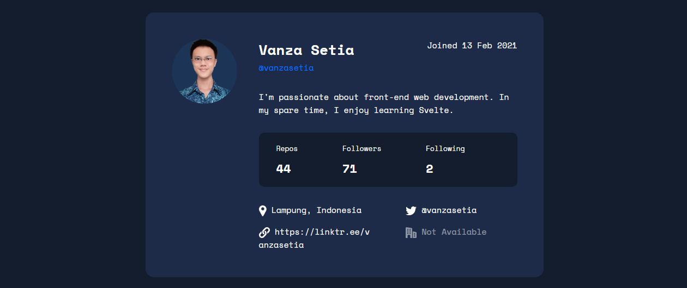

Anyway, let's continue the research! 

I was thinking, *"How does GitHub handle this problem?"*. Then, I took a look at the [mseidel819 profile on GitHub](https://github.com/mseidel819). After that, I inspected the styling of the element that holds value for the company.

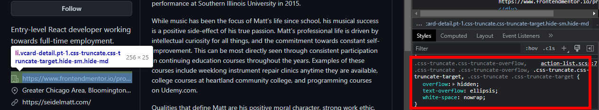

At this time, I knew that GitHub handle the overflowing text issue with three lines of code.

```css
.css-truncate.css-truncate-target {
  overflow: hidden;
  text-overflow: ellipsis;
  white-space: nowrap;
}
```

So, what did I do? Copy-paste the code! 😆

Now, the problem is solved!

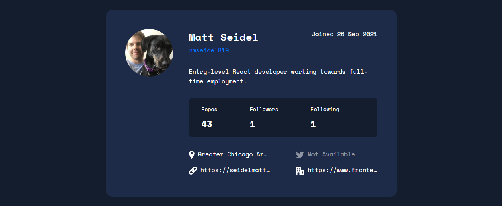

You might be wondering that if the text content is not visible then how the users would access the content? The text content is still 100% available. You can [try to copy-paste the text](https://officialdevfinder.netlify.app/?user=mseidel819&ref=overflowing-text) and you will get the full value. Also, I tested the site with Narrator and it can read the whole text.

But, I had a better solution for this problem.

So, instead of trying to keep forcing myself to follow the design. I tried to make the list into a one-column layout.

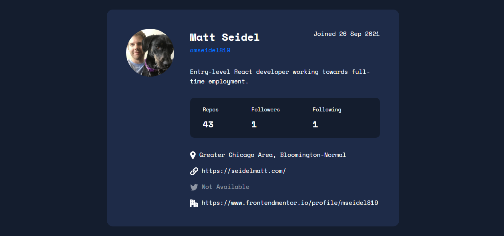

I think this is a good solution because not only does it fix the overflowing issue but also there's no visually hidden text. Everything can be seen clearly and nicely!

But, I still use GitHub's approach on how to solve the issue. The reason is that the challenge is trying to create the website looking as close to the design as possible.

### Feedback and Suggestions
[(Back to top)](#table-of-contents)

I am still new at asynchronous programming. So, if you notice some mistakes or spot some bad practices then feel free to let me know. I will update the code as well as the `README`! Also, I will add your name to the **Acknowledgements**.

### Useful Resources
[(Back to top)](#table-of-contents)

- [*"A Theme Switcher | Inclusive Components"*](https://inclusive-components.design/a-theme-switcher/) and [*"Toggle Buttons | Inclusive Components"*](https://inclusive-components.design/toggle-button/) articles are helping me to create accessible theme switcher. I would recommend everyone that doing this challenge read both articles!
- [ryanmcdermott/clean-code-javascript: Clean Code concepts adapted for JavaScript](https://github.com/ryanmcdermott/clean-code-javascript) - I wish that I know this repository when I was writing the JavaScript. This repository contains a lot of best practices on how to write clean JavaScript code. I highly recommend taking some time to read it!
- [RegExr](https://regexr.com/) - This is the tool that I used when I was crafting my RegEx or testing the RegEx that I want to use. It has a handy cheatsheet and is also easy to use. I'd recommend it to anyone that wants to create or test some RegEx!

## Author
[(Back to top)](#table-of-contents)

- Frontend Mentor - [@vanzasetia](https://frontendmentor.io/profile/vanzasetia)
- Twitter - [@vanzasetia](https://twitter.com/vanzasetia)
- Code Newbie - [@vanzasetia](https://community.codenewbie.org/vanzasetia)
- Want to see me on other platforms? [Check my linktree!](https://linktr.ee/vanzasetia)

## Acknowledgements
[(Back to top)](#table-of-contents)

Thanks to [@shinnn](https://officialdevfinder.netlify.app/?user=shinnn) for the Regular Expression to validate the user's input! It saves a lot of my time and energy for sure! 👍

## License
[(Back to top)](#table-of-contents)

>You can check out [the full license](./LICENSE)

This project is licensed under the terms of the MIT license.

## References

[(Back to top)](#table-of-contents)

> See the [documentation.](./docs/README.md)
